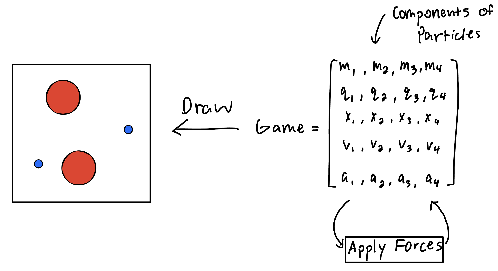
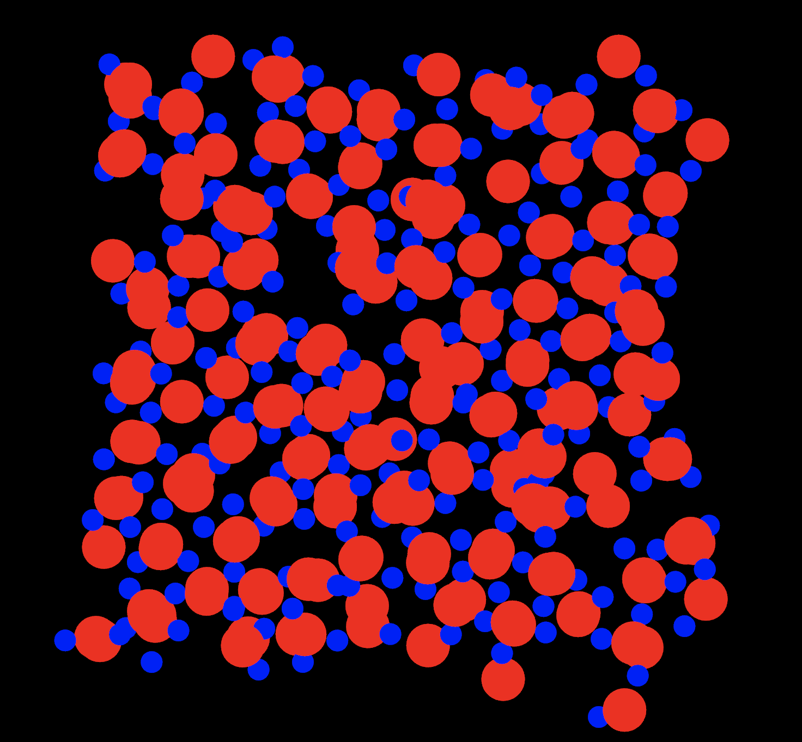

# Physics

## Description
This is a charged particle simulation written in Rust and using the [Bevy game engine](https://bevyengine.org/). It takes advantage of Bevy's excellent entity component system to implement the logic of the program. In the simulation, each particle can have a charge, mass, position, velocity, and acceleration. The forces present are the electrostatic force and friction. When starting the program, the particles will be in a regular grid with alternating charges. Over time, the structure becomes unstable and will dissolve. Blue particles have a negative charge while red particles have a positive charge. 

## How to run
I suggest you run it using `cargo run --release` because in normal debug mode, it will be too slow.

## Example
`cargo run --release`
